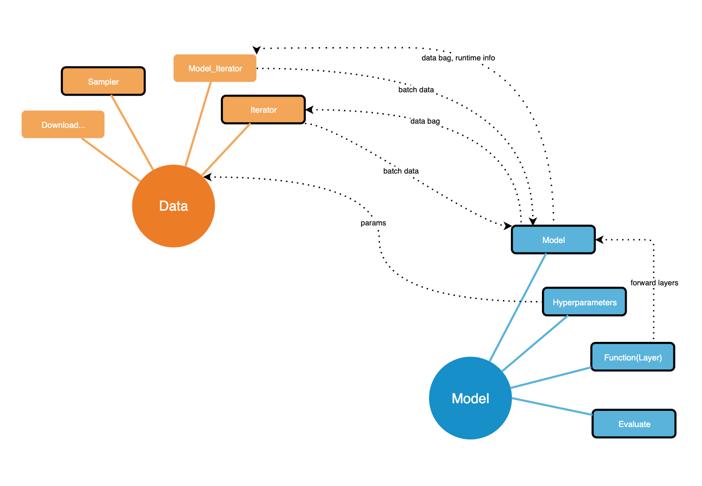

This repo aims to create a clearer, lighter framwork from MS-Recommender. 

### Why

1. Managing hyperparameters is really a mess up. The whole process rely on `tf.contrib.training.HParams` object, but using tons of function to make sure every param satisfy certain constains. Also it mannualy set the name space of all the hyperparameters, if you want to change defaults or add something,  you have to look up:

  ```python
  tf.contrib.training.HParams(
          # data
          kg_file=flags["kg_file"] if "kg_file" in flags else None,
          user_clicks=flags["user_clicks"] if "user_clicks" in flags else None,
          FEATURE_COUNT=flags["FEATURE_COUNT"] if "FEATURE_COUNT" in flags else None,
          ...
          # nextitnet
          eval_epoch=flags["eval_epoch"] if "eval_epoch" in flags else None,
          top_k=flags["top_k"] if "top_k" in flags else None,
      )
  # Almost 100 lines of parameters setting, nobody wants it
  # reco_utils/recommender/deeprec/deeprec_utils.py
  ```

  But in fact, check the hyperparameters shoud be something belongs to the designers of the model, only if they want it. It shouldn't be so messy.

  `models.training.params` offer a much easier hyperparameters management.

2. The design of the base classes can do better. Take `newsrec.models.BasicModel`  as an example, we really should only bound some abstract methods to such a base class. However, `newsrec.models.BasicModel` is bounded to many specific methods, which makes its sub-class not flexible enough

3. Lack of  unified apis. 

4. I want a `pytorch` version 😀.

    


## LightRec



Since there are tons of task in RecSys, of course the corresponding data formats and the forms of model will be different. Even for the same task, different models require different part of the information. For examples, in the general recommendation task, some of the models require the bipartite graph of the dataset, while others only require the interaction history of user-item. In the news recommendation, a news will have several feature(title, abstract, category…), not all the models will use all of them. That's why we offer the concept of `data_bag`, a way the model to tell which parts of the data are needed. `data_bag` simply can be a `list`. 